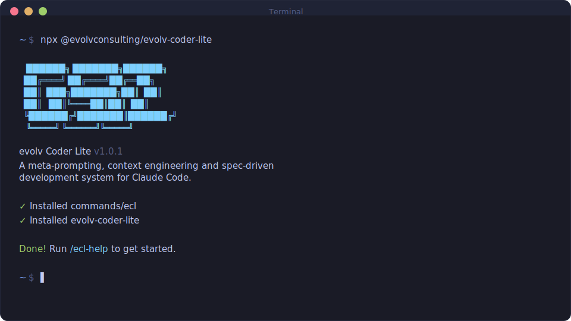

> # evolv Coder Lite (eCL)
>
> eCL is the [evolv Consulting](https://evolvconsulting.com) rebrand of the upstream [`@opengsd/get-shit-done-redux`](https://github.com/open-gsd/get-shit-done-redux) project. Functionality, contracts, and command surface track upstream releases; identifiers, package names, and command prefixes are renamed to the `ecl-*` / `@evolvconsulting/*` namespace.
>
> Issues, support, and roadmap for the eCL distribution: [evolvconsulting/evolv-coder-lite](https://github.com/evolvconsulting/evolv-coder-lite/issues).

<div align="center">

# EVOLV CODER LITE

**English** · [Português](README.pt-BR.md) · [简体中文](README.zh-CN.md) · [日本語](README.ja-JP.md) · [한국어](README.ko-KR.md)

**A light-weight meta-prompting, context engineering, and spec-driven development system for Claude Code, OpenCode, Gemini CLI, Kilo, Codex, Copilot, Cursor, Windsurf, and more.**

**Solves context rot — the quality degradation that happens as your AI fills its context window.**

[](https://www.npmjs.com/package/@evolvconsulting/evolv-coder-lite)
[](https://www.npmjs.com/package/@evolvconsulting/evolv-coder-lite)
[](https://github.com/evolvconsulting/evolv-coder-lite/actions/workflows/ci.yml)
[](https://discord.gg/mYgfVNfA2r)
[](https://github.com/evolvconsulting/evolv-coder-lite)
[](LICENSE)

<br>

```bash
npx @evolvconsulting/evolv-coder-lite@latest
```

**Works on Mac, Windows, and Linux.**

<br>



<br>

*"If you know clearly what you want, this WILL build it for you. No bs."*

*"I've done SpecKit, OpenSpec and Taskmaster — this has produced the best results for me."*

*"By far the most powerful addition to my Claude Code. Nothing over-engineered. Literally just gets shit done."*

<br>

**Trusted by engineers at Amazon, Google, Shopify, and Webflow.**

</div>

---

> [!IMPORTANT]
> **Returning to eCL?**
>
> Run `/ecl-map-codebase` to re-index your codebase, then `/ecl-new-project` to rebuild eCL's planning context. Your code is fine — eCL just needs its context rebuilt. See the [CHANGELOG](CHANGELOG.md) for what's new.

---

## Why I Built This

I'm a solo developer. I don't write code — Claude Code does.

Other spec-driven tools exist, but they're all built for 50-person engineering orgs — sprint ceremonies, story points, stakeholder syncs, Jira workflows. I'm not that. I'm a creative person trying to build great things consistently.

So I built eCL. The complexity is in the system, not in your workflow. Behind the scenes: context engineering, XML prompt formatting, subagent orchestration, state management. What you see: a few commands that just work.

The system gives Claude everything it needs to do the work *and* verify it. I trust the workflow. It just does a good job.

— **evolv Consulting**

---

## How It Works

The loop is six commands. Each one does exactly one thing.

### 1. Initialize

```bash
/ecl-new-project
```

Questions → research → requirements → roadmap. You approve it, then you're ready to build.

> **Already have code?** Run `/ecl-map-codebase` first. It analyzes your stack, architecture, and conventions so `/ecl-new-project` asks the right questions.

### 2. Discuss

```bash
/ecl-discuss-phase 1
```

Your roadmap has a sentence per phase. That's not enough to build it the way *you* imagine it. Discuss captures your decisions before anything gets planned: layouts, API shapes, error handling, data structures — whatever gray areas exist for this specific phase.

The output feeds directly into research and planning. Skip it, get reasonable defaults. Use it, get your vision.

### 3. Plan

```bash
/ecl-plan-phase 1
```

Research → plan → verify, in a loop until the plans pass. Each plan is small enough to execute in a fresh context window.

### 4. Execute

```bash
/ecl-execute-phase 1
```

Plans run in parallel waves. Each executor gets a fresh 200k-token context. Each task gets its own atomic commit. Walk away, come back to completed work with a clean git history.

Your main context window stays at 30–40%. The work happens in the subagents.

### 5. Verify

```bash
/ecl-verify-work 1
```

Walk through what was built. Anything broken gets a diagnosed fix plan — ready for immediate re-execution. You don't debug manually; you just run execute again.

### 6. Repeat → Ship

```bash
/ecl-ship 1
/ecl-complete-milestone
/ecl-new-milestone
```

Loop discuss → plan → execute → verify → ship until the milestone is done. Then archive, tag, and start the next one fresh.

---

## Getting Started

```bash
npx @evolvconsulting/evolv-coder-lite@latest
```

The installer prompts for your runtime (Claude Code, OpenCode, Gemini CLI, Kilo, Codex, Copilot, Cursor, Windsurf, and more) and whether to install globally or locally.

```bash
claude --dangerously-skip-permissions
```

eCL is built for frictionless automation. Skip-permissions is how it's intended to run.

Install only the skills you need with `--profile=core` (six core-loop skills), `--profile=standard` (core + phase management), or the default full install. Profiles compose: `--profile=core,audit`. `--minimal` is an alias for `--profile=core`. See **[docs/USER-GUIDE.md](docs/USER-GUIDE.md)** for the full walkthrough, non-interactive install flags for all 15 runtimes, and permissions configuration. See [ADR-0011](docs/adr/0011-skill-surface-budget-module.md) for the profile model and runtime surface control.

Current release highlights are in [docs/RELEASE-v1.42.1.md](docs/RELEASE-v1.42.1.md): package legitimacy checks, safer installer migrations, runtime surface control, custom ship PR sections, reviewer defaults, fallow structural review, and quota-aware execution recovery.

---

## Commands

The main loop:

| Command | What it does |
|---------|--------------|
| `/ecl-new-project` | Questions → research → requirements → roadmap |
| `/ecl-discuss-phase [N]` | Capture implementation decisions before planning |
| `/ecl-plan-phase [N]` | Research + plan + verify |
| `/ecl-execute-phase <N>` | Execute plans in parallel waves |
| `/ecl-verify-work [N]` | Manual acceptance testing |
| `/ecl-ship [N]` | Create PR from verified phase work |
| `/ecl-progress --next` | Auto-detect and run the next step |
| `/ecl-complete-milestone` | Archive milestone and tag release |
| `/ecl-new-milestone` | Start next version |
| `/ecl:surface` | Enable/disable skill clusters at runtime without reinstall |

For ad-hoc tasks, autonomous mode, codebase analysis, forensics, and the full command surface — see **[docs/COMMANDS.md](docs/COMMANDS.md)**.

---

## Why It Works

Three things most AI-coding setups get wrong:

**1. Context bloat.** As a session grows, quality degrades. eCL keeps your main context clean by doing the heavy work in fresh subagent contexts. Researchers, planners, and executors each start fresh with exactly what they need.

**2. No shared memory.** eCL maintains structured artifacts that survive session boundaries: `PROJECT.md` (vision), `REQUIREMENTS.md` (scope), `ROADMAP.md` (where you're going), `STATE.md` (current position and decisions), `CONTEXT.md` (per-phase implementation decisions). Every new session loads these and knows exactly where things stand.

**3. No verification.** Code that "runs" isn't code that "works." eCL's verify step walks you through what was built, diagnoses failures with dedicated debug agents, and generates fix plans before you declare a phase done.

See **[docs/ARCHITECTURE.md](docs/ARCHITECTURE.md)** for how the multi-agent orchestration and context engineering work in detail.

---

## Configuration

Settings live in `.planning/config.json`. Configure during `/ecl-new-project` or update with `/ecl-settings`.

Key dials:

| Setting | What it controls |
|---------|-----------------|
| `mode` | `interactive` (confirm each step) or `yolo` (auto-approve) |
| Model profiles | `quality` / `balanced` / `budget` — controls which model each agent uses |
| `workflow.research` / `plan_check` / `verifier` | Toggle the quality agents that add tokens and time |
| `parallelization.enabled` | Run independent plans simultaneously |

Optional structural review: set `code_quality.fallow.enabled` to `true` to add a fallow pre-pass to `/ecl-code-review`. eCL writes `.planning/phases/<phase>/FALLOW.json` and surfaces a `Structural Findings (fallow)` section in `REVIEW.md`. Install with `npm install -D fallow@^2.70.0` (or system-wide via `cargo install fallow`; note that the Rust binary's JSON schema must match the documented v2.70+ contract — older versions may produce silent zero-finding output).

Package legitimacy checks are built into the research, planning, and execution path: recommended dependencies get audited, unverified packages require a human checkpoint, and failed installs stop instead of trying similarly named alternatives.

For the full configuration reference — all settings, git branching strategies, per-runtime model overrides, workstream config inheritance, agent skills injection — see **[docs/CONFIGURATION.md](docs/CONFIGURATION.md)**.

---

## Documentation

| Doc | What's in it |
|-----|-------------|
| [User Guide](docs/USER-GUIDE.md) | End-to-end walkthrough, install options, all runtime flags, configuration reference |
| [Commands](docs/COMMANDS.md) | Every command with flags and examples |
| [Configuration](docs/CONFIGURATION.md) | Full config schema, model profiles, git branching |
| [Architecture](docs/ARCHITECTURE.md) | How the multi-agent orchestration works |
| [CLI Tools](docs/CLI-TOOLS.md) | `ecl-sdk query` and programmatic SDK dispatch seams |
| [Features](docs/FEATURES.md) | Complete feature index |
| [Changelog](CHANGELOG.md) | What changed in each release |

---

## Troubleshooting

**Commands not showing up?** Restart your runtime after install. eCL installs to `~/.claude/skills/ecl-*/` (Claude Code), `~/.codex/skills/ecl-*/` (Codex), or the equivalent for your runtime.

**Codex users — minimum supported CLI version is `0.130.0`.** Codex CLI 0.130.0 ([release notes](https://github.com/openai/codex/releases/tag/rust-v0.130.0)) removed extra-skill-roots discovery via [openai/codex#21485](https://github.com/openai/codex/pull/21485); from that version onward Codex discovers skills from standard roots (including `~/.codex/skills/<name>/SKILL.md`). eCL installs there directly. Earlier Codex CLI versions may still discover additional roots, which can surface duplicate `ecl-*` entries (one from extra-roots discovery, one from `~/.codex/skills/`); restart Codex after install and either upgrade or accept the duplicate listing.

**Something broken?** Re-run the installer — it's idempotent:
```bash
npx @evolvconsulting/evolv-coder-lite@latest
```

**Containers or Docker?** Set `CLAUDE_CONFIG_DIR` before installing to avoid tilde-expansion issues:
```bash
CLAUDE_CONFIG_DIR=/home/youruser/.claude npx @evolvconsulting/evolv-coder-lite --global
```

Full troubleshooting and uninstall instructions in **[docs/USER-GUIDE.md](docs/USER-GUIDE.md#troubleshooting)**.

---

## Community

| Project | Platform |
|---------|----------|
| [ecl-opencode](https://github.com/rokicool/ecl-opencode) | Original OpenCode port |
| [Discord](https://discord.gg/mYgfVNfA2r) | Community support |

---

## Star History

<a href="https://star-history.com/#evolvconsulting/evolv-coder-lite&Date">
 <picture>
   <source media="(prefers-color-scheme: dark)" srcset="https://api.star-history.com/svg?repos=evolvconsulting/evolv-coder-lite&type=Date&theme=dark" />
   <source media="(prefers-color-scheme: light)" srcset="https://api.star-history.com/svg?repos=evolvconsulting/evolv-coder-lite&type=Date" />
   
 </picture>
</a>

---

## License

MIT License. See [LICENSE](LICENSE) for details.

---

<div align="center">

**Claude Code is powerful. eCL makes it reliable.**

</div>
